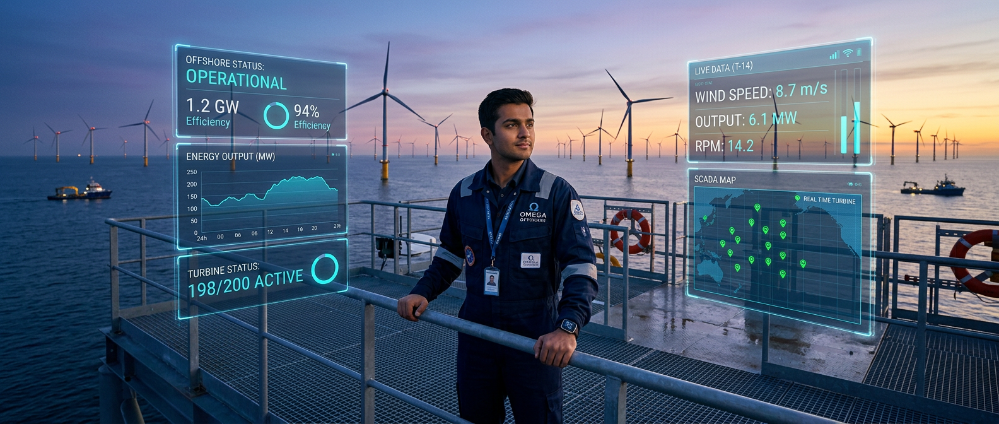

<!-- Animated Career Header -->

<!-- Professional Hero Banner -->

<!-- Glowing Divider -->

 

## 🌪️ The Origin: Aralvaimozhi to Artificial Intelligence

My story begins in the windswept plains of Aralvaimozhi, where the towering wind turbines that dominate my hometown's horizon shaped my family's legacy. Growing up within *Dynamic Wind Spares and Services Pvt Ltd*, my foundational education was written in steel, copper, and high voltage — long before I learned a line of code.

I saw firsthand the physical toll continuous operation takes on heavy infrastructure, and the enormous cost of unexpected mechanical failures. That led to a profound realization: a multi-ton turbine cannot foresee its own destruction — it simply operates until it breaks. It needs a mind to interpret its vibrations, thermal output, and electrical anomalies to predict its breaking points.

So I set out to bridge heavy legacy infrastructure with modern computational intelligence — giving a digital consciousness to industrial giants.

## ⚙️ The Crucible: Forged in Friction

Now an Electrical and Electronics Engineering student at Panimalar Engineering College in Chennai (7th semester), I deliberately built an engineering arsenal to back up my industrial intuition. A pivotal journey to IIT Madras in December 2024 sharpened my resolve to operate far beyond the standard syllabus.

The intersection of hardware and AI is unforgiving. My path meant debugging raw, low-level C for an ESP32 that refused to connect, wrestling with noisy environmental sensor signals, and forcing machine learning to understand the messy realities of SCADA telemetry data.

A one-month industrial training at the testing labs of **Tata Advanced Systems**, Bangalore, proved that theoretical code shatters on contact with enterprise-level stress testing — a baptism by fire that hardened my resolve to build systems that survive in the real world.

## 🧠 The Execution: Architecting the Future

I build systems that solve the industrial bottlenecks I grew up watching — not standard web apps.

- **AeroVigil AI** — Uses Physics-Guided Bayesian Neural Networks (PG-BNN) that obey the laws of thermodynamics and mechanical wear, predicting turbine faults with domain-aware precision.
- **AeroZip** — Compresses high-frequency SCADA telemetry to transmit over weak networks at remote wind farms.
- **Aetheris** — An autonomous agent framework for edge devices, making complex decisions without heavy cloud compute.
- **GreenChamp & IoT** — A civic platform for real-time municipal waste vehicle tracking, plus a smart classroom energy-optimization prototype built on Arduino Uno.

## 🧭 The Mindset

Engineering needs cold, mathematical logic, but sustaining an ambitious project also needs meaning. My ten-book fantasy epic, anchored in the martial lore of Lord Murugan, is the internal story behind the technical one. As the *Vel* pierces through ignorance, code pierces through systemic inefficiency. True innovation is often a solitary pursuit — and that solitude is a forge that turns sustained effort into lasting capability.

  

## 🛠️ The Arsenal

| System Domain | Execution Stack |
| :--- | :--- |
| **Artificial Intelligence** | Physics-Guided BNNs, Local LLMs (Ollama, Open WebUI), TinyML, Docker |
| **Edge Hardware & IoT** | ESP32, STM32, Arduino Uno, Advanced Sensor Integration |
| **Software Architecture** | Python, Java, C, TypeScript, Flutter, PostgreSQL, Supabase |
| **Industrial Mechanics** | Wind Turbine SCADA, Generator/Gearbox Diagnostics, Telemetry Compression |

### 🌐 Languages I Know

**Programming & Scripting**

  
  
  
  
  

**Frameworks, Databases & Tools**

  
  
  
  
  

**Hardware & Embedded**

  
  
  

## 🚀 The Blueprint

1. **The Core Startup Command** — Scale **AeroVigil AI** from a framework into a premier predictive maintenance enterprise for the global wind energy sector.
2. **The Autonomous Edge Domination** — Push the limits of localized agent execution with **Aetheris**, bringing offline AI directly to the industrial edge.
3. **The Academic Conquest** — Publish 6 peer-reviewed research papers at the intersection of AI and renewable energy optimization.
4. **The Global Expansion (Australia)** — Deploy this hardware/software vision at the highest levels of research and enterprise in **Australia**, a continent with massive wind resources that needs exactly this predictive infrastructure.

  

  <i>"I am not here to participate. I am not here to compete with the current standard. I am here to completely redefine the baseline of how renewable energy is understood, predicted, and maintained."</i>

    
  

## 🎧 The Soundtrack

  
  

*All 8 narration audio clips automatically play sequentially from start to finish upon entry.*
